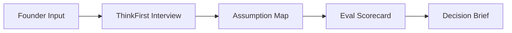

# ThinkFirst V2 Final Upgrade Plan

## 1) Product Direction (Final)

ThinkFirst should not become a generic AI PM eval tool.

ThinkFirst should stay focused on founders/builders and upgrade from a chatbot into an eval-first startup validation workbench.

Core positioning:

> ThinkFirst turns vague startup ideas into testable assumptions, evidence thresholds, and decision-grade validation briefs.

Employer-facing claim (for hiring managers):

> I designed and shipped an eval-first AI workflow product with a custom extraction pipeline, scoring rubric, and decision logic to reduce false confidence.

Core principle:

> Reduce false confidence. Do not generate prettier plans.

---

## 2) User + Audience Split (Final)

### Product user (who uses ThinkFirst)

- Startup founders
- Solo builders
- Hackathon teams
- AI-native builders
- Product operators with early ideas

### Hiring audience (who evaluates your proof-of-work)

- AI product hiring managers
- Founders and heads of product
- Consulting AI/data leads

ThinkFirst is for builders.

The case study is for employers.

---

## 3) V2 Experience (Before vs After)

### Current (V1)

1. User enters idea
2. 8-12 turn Socratic chat
3. Idea recap

### Target (V2)

1. User enters vague idea
2. 8-12 turn Socratic interview
3. System extracts assumptions + evidence gaps
4. System scores quality with eval rubric
5. System outputs decision-grade validation brief
6. System recommends next 3 validation experiments

---

## 4) Build Strategy: Upgrade, Not Rebuild

Keep what already works:

- Existing working app (desktop/mobile)
- Prompt and policy specs (v1 -> v3)
- 8 archetypes golden dataset
- 5 eval dimensions
- Existing finite-state style control logic

Add only what is missing:

1. Visible assumption map
2. Visible eval scorecard
3. Decision brief with Proceed/Investigate/Park/Revise

---

## 5) Execution Plan (Step-by-Step)

### Step 1 - Pick one flagship demo idea (30 min)

Choose one startup idea to run end-to-end through V2.

Criteria:

- Vague enough to expose false confidence
- Real enough to produce meaningful decision output
- Easy to explain in a 2-3 minute Loom

This is mandatory before implementation.

### Step 2 - Lock output schemas (1 hr)

Define strict JSON schema for:

- Assumption Map
- Eval Scorecard
- Decision Brief

Do this before coding prompts/UI.

Mandatory fields in final brief:

- One-sentence idea
- Target user
- Pain chain
- Current workaround
- Riskiest assumption
- Evidence needed
- Invalidation threshold
- Next 3 validation experiments
- Confidence level
- Honest gaps
- Decision (Proceed / Investigate / Park / Revise)

### Step 3 - Add extraction pass prompt (2-3 hrs)

After interview ends, run a dedicated extraction call:

- Input: conversation transcript
- Output: Assumption Map JSON

Rules:

- Extract only what user evidence supports
- If uncertain, flag as missing (never hallucinate)

### Step 4 - Add eval scoring pass prompt (2 hrs)

Run scoring call on extracted assumptions:

- Input: Assumption Map JSON
- Output: Eval Scorecard JSON

Use your existing 5 eval dimensions.

Each dimension must include:

- Score
- Reason
- Failure mode if weak
- Improvement suggestion

### Step 5 - Add decision brief pass prompt (1 hr)

Generate final decision output:

- Input: Assumption Map + Scorecard
- Output: Decision Brief JSON

Decision rules:

- Proceed: strong evidence and clear next tests
- Investigate: promising but critical gaps remain
- Park: weak evidence / unclear pain
- Revise: user/problem mismatch or idea shift required
- Calibration rule: if 2 or more critical assumptions are marked missing evidence, the system cannot output Proceed

### Step 6 - Wire backend sequence (3-4 hrs)

Keep chat flow unchanged.

When user clicks `Generate Analysis`, run:

1. Extract assumptions
2. Score output quality
3. Produce decision brief

Show loading and partial render progressively.

Run logging requirement:

- Record model name, model version, prompt version, and timestamp for each pass (extraction, scoring, decision brief) per run

### Step 7 - Build 3-panel UI (4-6 hrs)

Panel layout:

- Left: chat transcript + current question
- Middle: assumptions + evidence gaps
- Right: scorecard + final decision brief

### Step 8 - Run end-to-end demo + fix defects (2-3 hrs)

Run flagship idea plus 2-3 golden dataset ideas through full V2 flow.

Capture:

- Chat transcript
- Assumption map
- Scorecard
- Final brief
- Decision distribution across Proceed / Investigate / Park / Revise
- Percentage of assumptions marked missing evidence vs confirmed
- V1 vs V2 output completeness comparison on the same flagship idea
- Reproducibility log per run: model name/version, prompt version, timestamp for all 3 passes

Metric definitions (lock before running):

- Output completeness = (number of non-empty required Decision Brief fields) / (total required Decision Brief fields) * 100
- Missing evidence rate = (number of assumptions labeled missing evidence) / (total extracted assumptions) * 100
- Confirmed evidence rate = (number of assumptions supported by explicit transcript evidence) / (total extracted assumptions) * 100
- Constraint: Missing evidence rate + Confirmed evidence rate should equal 100% for each run

Fix obvious reasoning/output bugs before packaging.

### Step 9 - Capture before/after proof (1 hr)

Produce two key screenshots:

- Before: V1 recap-only output
- After: V2 3-panel decision workflow

These become your strongest visual evidence.

### Step 10 - Package proof-of-work assets (5-7 hrs)

Deliverables:

- Case study page (primary)
- GitHub README section
- 2-3 minute Loom walkthrough
- One-page outreach memo (base template)
- Three tailored outreach variants: Arize AI, Decagon, Hume AI

---

## 6) Case Study Narrative (Final)

Use this framing:

> I built ThinkFirst, an eval-first validation workbench that turns vague founder ideas into decision-grade validation briefs.

Case study structure:

1. Problem
2. Target user
3. Product approach
4. AI behavior design
5. Architecture and flow control
6. Architecture decisions and tradeoffs (why multi-pass vs single-pass, why strict JSON, model choices, latency/cost tradeoffs)
7. Eval framework (8 archetypes, 5 dimensions) with rationale for each dimension
8. Iteration history (v1 -> v2 -> v3)
9. Failure modes and mitigations (at least 3-5 concrete cases)
10. AI behavior risks and guardrails (anti-hallucination, confidence calibration, Investigate vs Park boundary)
11. Quantitative results from flagship + dataset runs
12. Final output artifact (decision brief)
13. Reflection: AI PM judgment and tradeoffs

---

## 7) Timebox + Scope Guardrails

Estimated total: 2-3 focused days.

### Keep in scope

- One flagship idea
- One polished end-to-end flow
- One strong case study

### Do not build now

- TAM/competitor automation
- PRD/GTM generator features
- Accounts/auth/session history
- Marketing site redesign
- Multi-idea dashboards

---

## 8) Success Criteria (Definition of Done)

V2 is done when:

1. Live app shows 3-panel workflow
2. Flagship idea runs end-to-end
3. Decision brief is structured and actionable
4. Before/after evidence is captured
5. Case study + Loom + outreach memo base template + 3 tailored variants (Arize AI, Decagon, Hume AI) are ready

If a hiring manager sees it and immediately understands:

- You define AI quality before shipping
- You evaluate output reliability, not only UX polish
- You convert ambiguity into product decisions

Then the upgrade succeeded.

---

## 9) Immediate Next Action

Start with Step 1 now: pick the flagship demo idea.

Everything else (prompt design, UI panels, case study quality) depends on that choice.